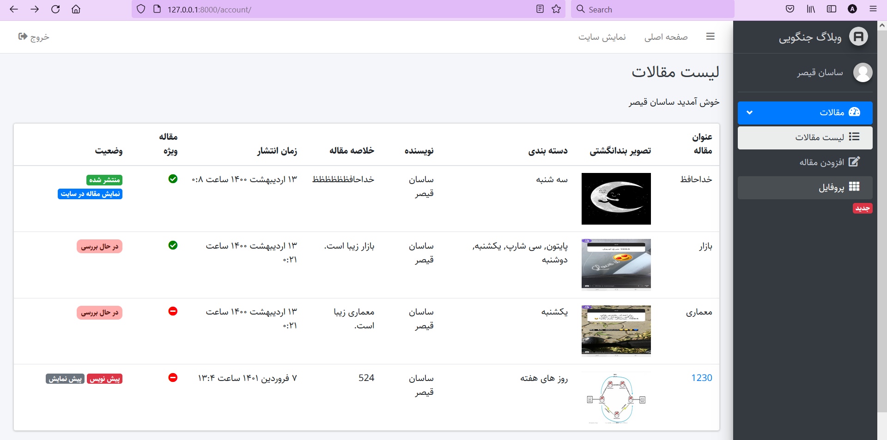

# Django Article Management
An article management service deployed in django



## Installation

```shell
$ git clone https://github.com/aylinghsr/django_article_management.git
$ cd django_article_management
```

## Requirements
Requirements can be installed using the following command:
```shell
$ pip install -r requirements.txt
```


## Usage
To start the server run the following command:
```shell
$ python manage.py runserver
```

The server starts at http://127.0.0.1:8000/

| URL  | Page  |
| :------------: |:---------------:|
| **admin** | Admin Page |
| **login** | Login Page |
| **register** | Register  |
| **account** | User Account |
